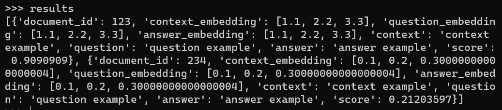

# elasticsearch_api

## building the docker

```cmd
docker build `
-t jingyanwang1/ebedding_vector_search:1.0.2 `
.
```

## runing the docker

```cmd
docker run -it `
-p 0.0.0.0:9466:9466 `
-p 0.0.0.0:3671:3671 `
-p 0.0.0.0:5145:5145 `
jingyanwang1/ebedding_vector_search:1.0.2
```


## start es

```python

import pandas as pd
from elasticsearch_api.jessica_es import *
from elasticsearch_api.jim_es_vector_search import *

# start the es

es_session = start_es(
	es_path = "/wang/elasticsearch-7.13.4",
	es_port_number = "9466",
	es_tcp_port_number = "3671")

'''
localhost:9466
'''

# insert a vector

start_kibana(
	kibana_path = '/wang/kibana-7.13.4-linux-x86_64',
	kibana_port_number = "5145",
	es_port_number = "9466",
	)

'''
localhost:5145
'''

```

## building the index

```python
build_vector_index(
	index_name = "prompt_embedding_index",
	vector_fields = [
		{"vector_name":"context_embedding", "vector_dim":3},
		{"vector_name":"question_embedding", "vector_dim":3},
		{"vector_name":"answer_embedding", "vector_dim":3},
		],
	es_session = es_session,
	)
```
  
## prepare the data to insert into the index

```python
data_body = [
	{
		'document_id': "123",
		"context_embedding":[1.1,2.2,3.3], 
		"question_embedding":[1.1,2.2,3.3], 
		"answer_embedding":[1.1,2.2,3.3], 
		"context":"context example",
		"question":"question example",
		"answer":"answer example",
	},
	{
		'document_id': "234",
		"context_embedding":[0.1,0.2,0.3], 
		"question_embedding":[0.1,0.2,0.3], 
		"answer_embedding":[0.1,0.2,0.3], 
		"context":"context example",
		"question":"question example",
		"answer":"answer example",
	},
	]

pd.DataFrame(data_body).to_json(
	'data.json',
	lines = True,
	orient = 'records',
	)
```


## inseart the data to index


```python
ingest_json_to_es_index(
	json_file = 'data.json',
	es_index = 'prompt_embedding_index',
	es_session = es_session,
	document_id_feild = 'document_id',
	)
```


## or insert a doc to the index

```python

r = {
	'document_id': "456",
	"context_embedding":[0.1,0.2,0.0], 
	"question_embedding":[0.1,0.2,0.0], 
	"answer_embedding":[0.1,0.2,0.0], 
	"context":"context example 1",
	"question":"question example 2",
	"answer":"answer example 3",
	}

insert_doc_to_es(
	r,
	check_value_is_none = True,
	es_index = 'prompt_embedding_index',
	document_id_feild = 'document_id',
	)
```

#### check the data in es
http://localhost:9466/prompt_embedding_index/_search?pretty=true


## query by vector similarity 

```python
results = search_by_vector(
	index_name = 'prompt_embedding_index',
	vector_field_name = 'context_embedding',
	query_vector = [1.0,2.2,3.3],
	es_session = es_session,
	similarity_measure = 'euclidean',
	return_entity_max_number = 2,
	)
```



